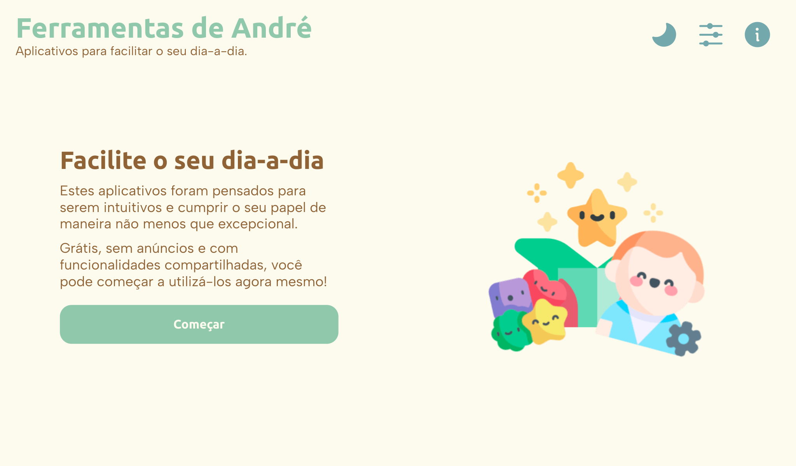

# Ferramentas de André
Esse site agrupa todas as ferramentas criadas por mim, bem como recursos e outros.

> Criado para facilitar a manutenção e reusabilidade do código, com a finalidade de ser o cerne de todas as atuais e futuras ferramentas que eu criar.

- - - 

## O que aprendi com esse projeto? 🎯
- Criação de código moldular e reutilizável.
- Uso de try-catch statments para fallback actions.
- Uso do fetch para recolher, moldar e inserir snippets HTML na página.
- Criação de interações do usuário para com o compartamento da página (painel PUAU).
- Conceito de divisão de grandes projetos em fragmentos para facilitar a execução.
- Animações simples em CSS e JavaScript.

- - - 

## Log
- **Atualização 2.5.5**
    - **Gerador de QR Code (1.3.1):**
        - Corrigido erro de execução que não inicializava a função `QRCode.ParametrosURL.obter()` ao inicializar a página.
    - Agora há novidades globais, adicionadas a todas as ferramentas, sua origem é o `essencial.js`.
    - Agora os acionadores dos ícones de ação no cabeçalho são adicionados pelo `essencial.js`, não mais pelo script individual de cada página.
    - Atualização das capturas de tela das páginas.
    - Grande atualização na função importarPedacos.
        - Mais popups são importados pela função.
        - Novas pastas foram criadas dentro de `/pedaco/` que correspondem aos popups e minipoups.
        - O cabeçalho das páginas agora é importado.
    - Nova função global adicionada: compartilhar a página (via navigator.share API).
    - O novo objeto `Popup` está sendo adicionado ao `essencial.js` visando centralizar as ações relacionadas ao Popups. Novos objetos para o PUAU estão a caminha também.
    - Otimização geral do `essencial.js`.
    - Todas as páginas agora possuem o novo layout que foca apenas na ferramenta.

- **Atualização 2.5.4**
    - Agora as informações apresentadas no *popup_log_novidades* e *popup_sobre* são preenchidas através do novo Objeto *Info*, em *Ferramenta*, no código da página.
    - O `<header>` e os popups de todas as páginas agora são importados através do `fecth` em `/pedacos/`.
    - O novo layout das páginas agora prioriza a ferramenta em si, removendo a seção de informações.
    - Otimizações gerais no código.

- **Atualização 2.5.3**
    - **Gerador de Lorem Ipsum (1.4.1):**
        - Ajuste nas configurações padrão do PUAU da ferramenta.
    - **Gerador de QR Code (1.3):**
        - Agora a ferramenta é capaz de utilizar parâmetros de URL para realizar ações automaticamente. Essa habilidade será útil para futuras integrações com outras ferramentas.
        - Remodelagem da página para destacar mais a ferramenta.

- **Atualização 2.5.2**
    - **Gerador de Lorem Ipsum (1.4):**
        - A ferramenta agora entrega resultados mais satisfatórios na geração de textos para Palavras, Frases e Parágrafos.
        - Diversas otimizações de código.
        - Remodelagem da página para destacar mais a ferramenta.

- **Atualização 2.5.1**
    - A opção do PUAU "Tema do dispositivo" foi alterada para cód. 1 em todas as páginas.
    - Ajustes na disposição das opções do PUAU.

- **Atualização 2.5**
    - Adicionada opção de acessibilidade com a fonte Atkinson Hyperlegible, disponível através do PUAU.
    - Agora é possível sincronizar o tema da página com o tema do seu dispositivo.
    - Corrigida falha na página inicial em que os cartões das ferramentas não se adequava corretamente ao tamanho da tela.
    - Corrigido problema que não permitia que o PUAU se auto-ajustasse com as novas funções após o usuário interagir com ele através do popup.
    - Grande otimização na forma de importação dos pedaços (snippets) HTML.
    - O código do PhosphorIcons foi removido do cabeçalho de todas as páginas, visando melhoria no desempenho de carregamento.
    - Otimização no código de auto-ajuste do PUAU.

- **Atualização 2.4**
    - Adição das ferramentas ao repositório, centralizando as alterações.
    - Alteração dos nomes das ferramentas nos scripts e nas URLs. 
    - Ativação da funcionalidade do PUAU de sincronização do tema da página dentre as ferramentas: Essa função estará em breve disponível para todas as ferramentas.
    - Correção da exibição do ícone da ferramenta Link de WhatsApp no cartão da ferramenta de Gerador de QR Code.
    - Diversas alterações nas ferramentas para uma melhor integração.

- **Atualização 2.3**
    - Nova ferramenta: Gerador de QR Code.

- **Atualização 2.2**
    - Agora o código para importação dos pedaços está presente no `essencial.js`.
    - Alterada cor do botão principal para aumentar visibilidade.
    - Alterado ordem de exibição entre os ícones do Tema Claro e Escuro.
    - Corrigido erro de não abertura de links externos em botões dos popups.
    - Corrigido erro de não exibição dos estilos da página de 404 quando dentro de um diretório no domínio.
    

- **Atualização 2.1**
    - Corrigido erro no universal.css que gerava problemas de responsividade em outras ferramentas.

- **Atualização 2.0**
    - Adição de imagens em maior resolução.
    - Atualização do uso da API Fetch.
    - Correção de textos, estilos e afins.
    - Importação do painel PUAU via Api Fetch agora funcionando como esperado.
    - Nova capa para o site.
    - Otimização de código.
    - Painel PUAU totalmente funcional, com autoconfiguração, retenção das preferências do usuário e atualizável com sobreposição das preferências do usuário.
    - Remoção do borrado de fundo ao abrir um Popup.
    - Sistema completamente novo de armazenamento de informações localmente.

- **Atualização 1.0**
    - Lançamento do site.
    - Criação do `README.md`.

- - -

## Imagens do projeto 📸
Confira as imagens do projeto, que representam a sua versão mais recente.

  
