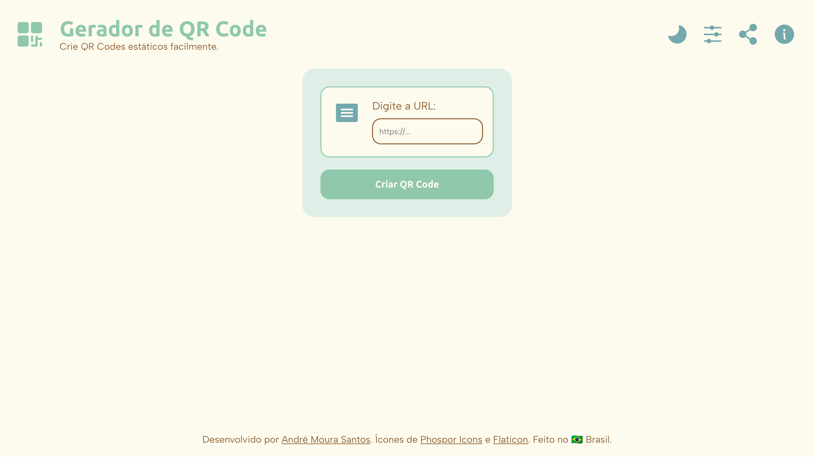
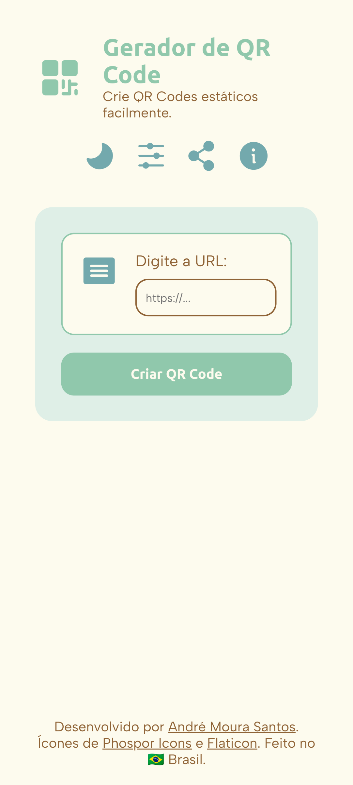

# Gerador de QR Code
Com esta ferramenta, você pode criar QR Estáticos para diversos fins através da API oficial do Google.

> Conseguir criar um QR Code sem precisar entrar em sites cheios de anúncios era o objetivo deste projeto.

- - -

## O que aprendi com este projeto? 🎯
- Procurar e ler documentações de APIs.
- Compreender a documentação do Google Charts para criação do QR Code, observando os diferentes parâmetros e formas de interação.
- Usar parâmetros de URL para realizar ações na página e utilizar `encodeURIComponent` e `dencodeURIComponent` para evitar erros de leitura.
- Utilizar JS para redimensionar elementos no HTML da página.
- Aprendi sobre `blob` e como utilizá-lo para obter informações de imagens e convertê-las em um arquivo que o usuário possa baixar.

- - -

## Log
- **Atualização 1.3**
    - Agora a ferramenta é capaz de utilizar parâmetros de URL para realizar ações automaticamente. Essa habilidade será útil para futuras integrações com outras ferramentas.
    - Remodelagem da página para destacar mais a ferramenta.

- **Atualização 1.2**
    - Otimizações de código.

- **Atualização 1.1**
    - Criação do arquivo README.md e da licença MIT para o projeto.

- **Atualizaão 1.0**
    - Lançamento da ferramenta.

- - -

## Imagens do projeto 📸
Confira as imagens do projeto, que representam a sua versão mais recente.

  
